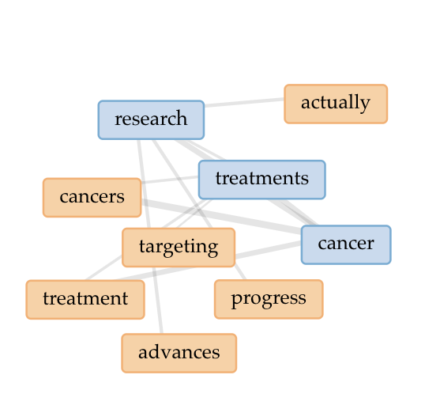



# Distant Reading Assignment 

I used Voyant to search this website [Cancer research website](https://musicbeatscancer.org/why-is-cancer-research-advancing-so-slowly/?gad_source=1&gad_campaignid=22437174633&gbraid=0AAAAADmntzevauOlAeSqIL3uXmFrvwBUq&gclid=CjwKCAjw_fnFBhB0EiwAH_MfZkL_IEI-JfsNAD4ooiQp81GXs5W79HMfdF85drgOiEsaKGSYQnxjCRoCEB0QAvD_BwE)

Using Voyant I learned things 

Check out my image

---
Using Copilot, I learned that cancer research is a slow but rewarding process. There are many challenges in discovering new treatments such as long testing processes but results have shown for some survival rate increasements. Research is playing a major part in enacting changes which are necessary to accelerate progress. Heres some of our conveersation:

Scientific progress in cancer research has been substantial, especially since the 1990s, with breakthroughs in DNA sequencing, real-time PCR, cloning, and understanding cancer biology.
Some cancers, like childhood leukemia and lymphomas, have seen improved survival rates, but many others—such as metastatic breast, lung, and pancreatic cancers—still have high mortality.
Ultimately, the article calls for greater support and systemic changes to ensure that scientific advancements lead to real-world cures and improved outcomes for cancer patients
